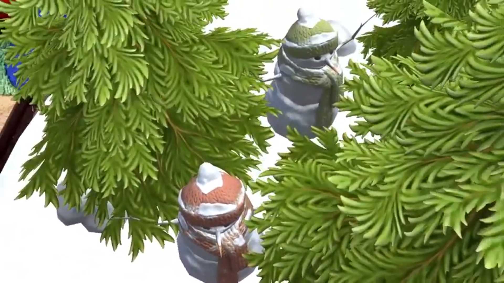

# TreasureHuntAR
 Find the snowmen's treasure!!

   
  
   
   

# Demo

YouTube URL - https://www.youtube.com/watch?v=-JnQDA3Q2LI

# Quickstart

- Download [Unity](https://unity3d.com/get-unity/download/archive) version 2018
  or above.
- Download Microsoft
  [Visual Studio Community](https://visualstudio.microsoft.com/).
- Platform specific SDK such as Android build tools are also required.

## How to Use?

- To build the project you need to go to _Menu>Build Settings>your-os>Build And
  Run_
- Don't forget to change the **Bundle Id** under the _Menu>Build
  Settings>your-os>Player Preferences_

Made with ❤ by [AgrMayank](https://AgrMayank.GitHub.io)
